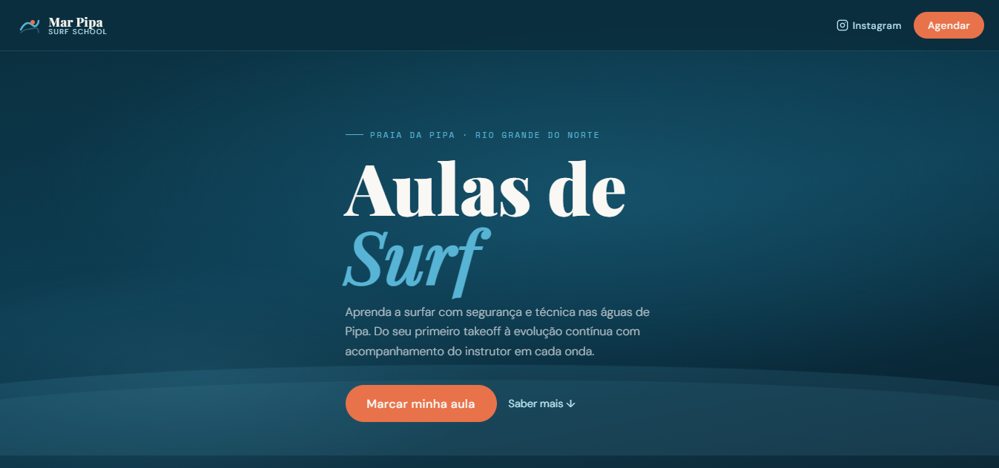
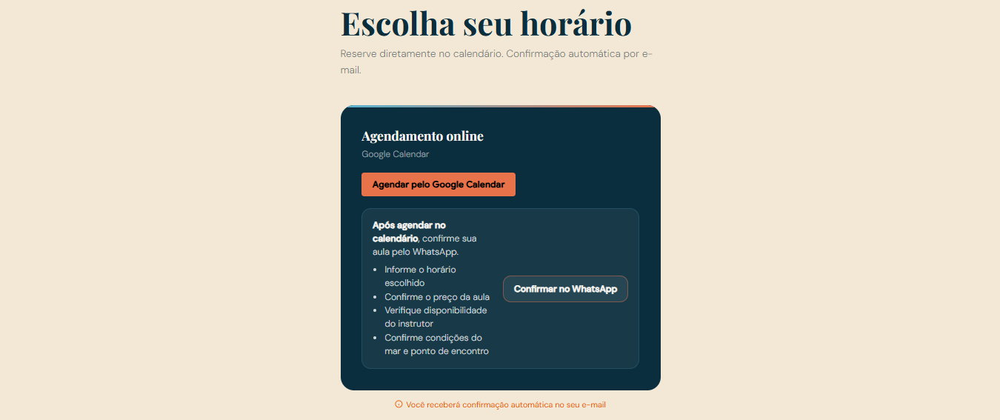
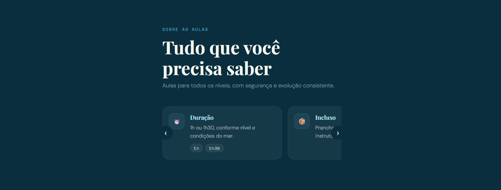

# Mar Pipa Surf School

Landing page simples para agendamento de aulas de surf em **Praia de Pipa (RN)**.

## Proposta do projeto

Este site foi desenvolvido com uma proposta simples e direta: permitir que interessados em aulas de surf possam **agendar rapidamente um horário e confirmar os detalhes da aula**.

Fluxo do usuário:

1. Escolher um horário disponível no **Google Calendar**
2. Realizar o agendamento
3. Confirmar informações essenciais pelo **WhatsApp**

Assim é possível alinhar rapidamente:

- valor da aula
- disponibilidade do instrutor
- condições do mar
- ponto de encontro

## Capturas de tela

### Página inicial

### Agendamento

### Sobre

## Tecnologias

- HTML
- CSS
- JavaScript
- Google Calendar Scheduling
- GitHub Pages